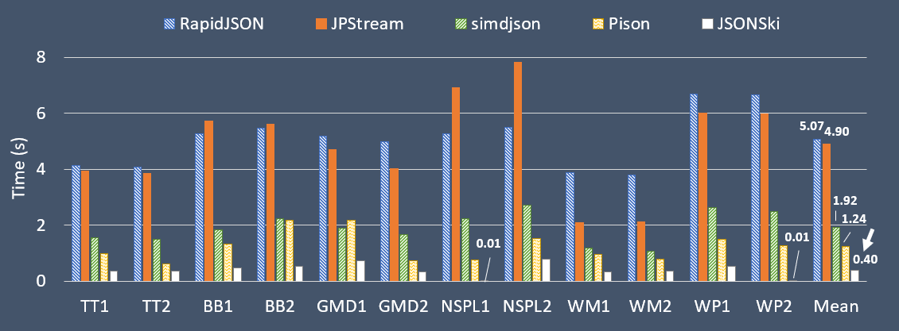

[](https://app.circleci.com/pipelines/github/AutomataLab/JSONSki)  
[](https://rawcdn.githack.com/AutomataLab/JSONSki/2277cf784217b2683d5c0229ad33194d63d2da78/html/md_jsonski_c____j_s_o_n_ski__r_e_a_d_m_e.html)


# JSONSki
JSONSki is **a streaming JSONPath processor** with **fast-forward** functionality. During the streaming, it can automatically fast-forward over certain JSON substructures that are irrelavent to the query evaluation, without parsing them in detail. To make the fast-forward efficient, JSONSki features a highly bit-parallel solution that intensively utilizes bitwise and SIMD operations that are prevelent on modern CPUs to implement the fast-forward APIs. For more details about JSONSki, please refer to our paper [1].


## Publication
[1] Lin Jiang and Zhijia Zhao. [JSONSki: Streaming Semi-structured Data with Bit-Parallel Fast-Forwarding](https://dl.acm.org/doi/10.1145/3503222.3507719). In Proceedings of the Twenty-Third International Conference on Architectural Support for Programming Languages and Operating Systems (ASPLOS), 2022. 

**[Best Paper Award Winner](https://asplos-conference.org/2022/)**

```
@inproceedings{jsonski,
  title={JSONSki: Streaming Semi-structured Data with Bit-Parallel Fast-Forwarding},
  author={Lin Jiang and Zhijia Zhao},
  booktitle={Proceedings of the Twenty-Third International Conference on Architectural Support for Programming Languages and Operating Systems (ASPLOS)},
  year={2022}
}
```

## Getting Started

### Build and Run

#### Platform
- **Hardware**: CPUs with `64-bit ALU instructions`, `256-bit SIMD instruction set`, and the `carry-less multiplication instruction (pclmulqdq)`
- **Operating System**: `Linux`
- **C++ Compiler**: `g++` (7.4.0 or higher)

#### Build
  ```
  make clean
  make all
  ```
#### Run
Assume executable example file is `example1`.
  ```
  cd bin
  ./example1
  ```
### NPM Package (JavaScript Binding)
- You can download the npm package from here: https://www.npmjs.com/package/jsonski
- You can checkout the npm repository here: https://github.com/AutomataLab/JSONSki_nodejs/tree/master

### JSONPath
JSONPath is the basic query language of JSON data. It refers to substructures of JSON data in a similar way as XPath queries are used for XML data. For the details of JSONPath syntax, please refer to [Stefan Goessner's article](https://goessner.net/articles/JsonPath/index.html#e2). 

#### Supported Operators (to be updated)
| Operator                  |   Description     |
| :-----------------------: |:-----------------:|
| `$`                       | root object              |
| `.`                       | child object      |
| `[]`                       | child array      |
| `*`                       | wildcard, all objects or array members          |
| `[index]`             | array index      |
| `[start:end]`             | array slice operator      |

#### Operators Not Supported (to be updated)
| Operator                  |   Description     |
| :-----------------------: |:-----------------:|
| `@`                       | current object filtered by predicate      |
| `..`                      | decendant elements |
| `[?(<expression>)]`       | filter expression for evaluation |
| `[index1, index2, ...]`             | multiple array indexes      |
| `[-start:-end]`             | last few array elements      |
| `$..[*]`                       | get all arrays      |
| `()`                       | script expression, using underlying script engine   |

#### Path Examples
Consider a piece of geo-referenced tweet in JSON
```javascript
{
    "coordinates": [
        40.74118764, -73.9998279
    ],
    "user": {
        "id": 6253282
    },
    "place": {
        "name": "Manhattan",
        "bounding_box": {
            "type": "Ploygon",
            "pos": [
                [-74.026675, 40.683935],
                ......
            ]
        }
    }
}
```
| JsonPath | Result |
| :------- | :----- |
| `$.coordinates[*]` | all coordinates     |
| `$.place.name` | place name   |
| `$.place.bounding_box.pos[0]`| first position of the bounding box in place                      |
| `$.place.bounding_box.pos[0:2]`| first two positions of the bounding box in place                      |


### APIs
#### Records Loading (Class: `RecordLoader`)
- `static Record* loadSingleRecord(char* file_path)`: loads the whole input file as one single record (allow newlines in strings and other legal places). 
- `static RecordSet* loadRecords(char* file_path)`: loads multiple records from the input file (all newlines are treated as delimiters; no newlines (except for `\n` and `\r` in JSON strings) are allowed within a record); `RecordSet` can be accessed in array style (see `example3.cpp` and `example4.cpp` in `example` folder).
#### Query Processor (Class: `QueryProcessor`)
- `QueryProcessor(string query)`: initialization, including query automaton construction and some internal variables initialization for bit-parallel fast-forwarding.
- `string runQuery(Record* record)`: run query on the specific record and get results.
- All bit-parallel fast-forward functions proposed in our paper [1] (see below) are supported in QueryProcessor class.
#### Fast-Forward APIs
These APIs advance the current streaming position `pos` to a future position to achieve the fast-forward effects.
| **Group 1** | **Fast-forward to a type-specific attribute / element** |
| :----------------------- |:--------------------------------------------------|
|`goToObjAttr()`| In an object, move `pos` to the next attribute of object type|
|`goToAryAttr()`| In an object, move `pos` to the next attribute of array type |
|`goToObjElem()`| In an array, move `pos` to the next element of object type   |
|`goToAryElem()`| In an array, move `pos` to the next element of array type    |
|`goToObjElem(K)`| In an array, move `pos` to the next element of object type within `K` elements|
|`goToAryElem(K)`| In an array, move `pos` to the next element of array type within `K` elements|
| **Group 2** |**Fast-forward over an unmatched attribute value** |
|`goOverObj()`| move `pos` to the end of the next object|
|`goOverAry()`| move `pos` to the end of the next array |
|`goOverPriAttr()`| move `pos` to the end of the next attribute of primitive type |
|`goOverPriElem()`| move `pos` to the end of the next element of primitive type |
| **Group 3** |**Fast-forward over a value and output it** |
|`goOverObj(out)`| move `pos` to the end of the next object meanwhile output the object|
|`goOverAry(out)`| move `pos` to the end of the next array meanwhile output the array|
|`goOverPriAttr(out)`| move `pos` to the end of the next attribute of primitive type meanwhile output the primitive|
|`goOverPriElem(out)`| move `pos` to the end of the next element of primitive type meanwhile output the primitive|
| **Group 4** |**Fast-forward to the end of current object** |
|`goToObjEnd()`| In an object, move `pos` to the end of the current object|
| **Group 5** |**Fast-forward over out-of-range array elements** |
|`goOverElem(K)`| move `pos` to the end of next `K` elements|
|`goToAryEnd()`| move `pos` to the end of the current array|

#### API Usage Examples
A few examples (in `cpp` files) are provided in the `example` folder. They demostrate how to use our APIs to implement JSON queries. To create and test your examples, please update the `makefile` accordingly.


## Performance Results

### Dataset
Four sample datasets are included in `dataset` folder. Large datasets (used in performance evaluation) can be downloaded from https://drive.google.com/drive/folders/1KQ1DjvIWpHikOg1JgmjlSWM3aAlvq-h7?usp=sharing and placed into the `dataset` folder. 

### Methods Comparison
We compared JSONSki with [RapidJSON](https://github.com/Tencent/rapidjson), [JPStream](https://github.com/AutomataLab/JPStream), [simdjson](https://github.com/simdjson/simdjson) and [Pison](https://github.com/AutomataLab/Pison) for processing (i) a single bulky JSON record and (ii) a sequence of small JSON records. For non-streaming mdethods (RapidJSON, simdjson, and Pison), we included both the preprocessing time (parsing or indexing) and the querying time. Same datasets from [Pison](https://github.com/AutomataLab/Pison) repository are used in this performance evaluation, including tweets (TT) from Twitter developer API, Best Buy (BB) product dataset, Google Maps Directions (GMD) dataset, National Statistics Post-code Lookup (NSPL) dataset for United Kingdom, Walmart (WM) product dataset, and Wikipedia (WP) entity dataset. Each dataset is a single large JSON record of approximately 1GB. Small records are extracted from the dominating array (a large array consists with sub-records) in each dataset, and are delimited by newlines. For each dataset, we created two JSONPath queries, listed in the following table:

| ID                  |   JSONPath Query                     |    Number of Matches   |
| :-----------------: |:---------------------------| :---------------------:|
| TT1                  |   `$[*].entities.urls[*].url`     |    88,881            |
| TT2                  |   `$[*].text`     |    150,135            |
| BB1                  |   `$.products[*].categoryPath[1:3].id`  |    459,332            |
| BB2                  |   `$.products[*].videoChapters[*].chapter`  |    8,857            |
| GMD1                 |   `$[*].routes[*].legs[*].steps[*].distance.text`  |    1,716,752            |
| GMD2                 |   `$[*].available_travel_modes`  |    270            |
| NSPL1                       | `$.meta.view.columns[*].name`     |    44     |
| NSPL2                       | `$.data[*][*][2:4]`     |    3,509,764     |
| WM1                    | `$.items[*].bestMarketplacePrice.price`      |   15,892  |
| WM2                    | `$.items[*].name`      |   272,499  |
| WP1                       | `$[*].claims.P150[*].mainsnak.property`          |  15,603  |
| WP2                      | `$[10:21].claims.P150[*].mainsnak.property`          |  35  |


### Machine Configuration
CPUs: two Intel 2.1GHz Xeon E5-2620 v4 (64-bit ALU operations and 256-bit SIMD instructions).

Memory: 128GB RAM. 


### Processing A Single Large Record
The following figure reports the execution time of different methods for single large record processing. Results show that JSONSki runs over 12x faster over the existing JSON streaming tool [JPStream](https://github.com/AutomataLab/JPStream), thanks to its bitwise fast-forward optimizations. Comparing to other SIMD-based JSON tools, JSONSki is about 3x faster than [Pison](https://github.com/AutomataLab/Pison), and more than 4x faster than [simdjson](https://github.com/simdjson/simdjson). 

<figcaption style="text-align:center"><b>Fig.1 - Execution Time of Processing A Single Large Record.</b></figcaption>
<br/>
</img>

### Processing Many Small Records
Fig.2 shows the performance results of processing a sequence of small records, which are similar to those of processing single large records, except that most methods run a bit faster, thanks to the better cache locality.

<figcaption style="text-align:center"><b>Fig.2 - Execution Time of Processing A Sequence of Small Records.</b></figcaption>
<br/>
</img>

More evaluation results can be found in our ASPLOS'22 paper [1].
